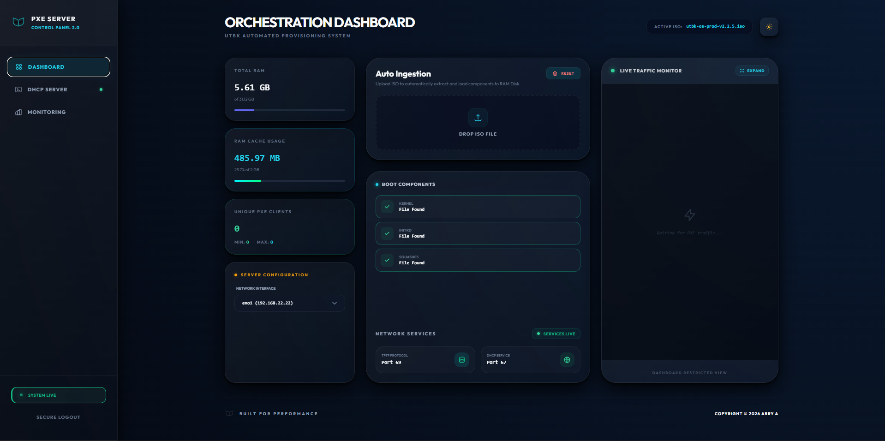
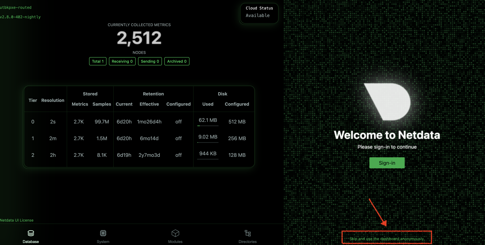
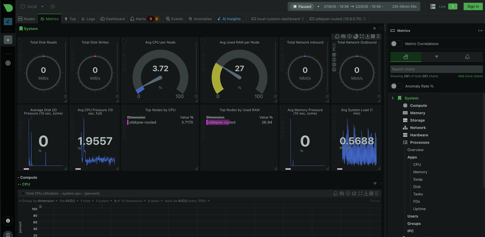
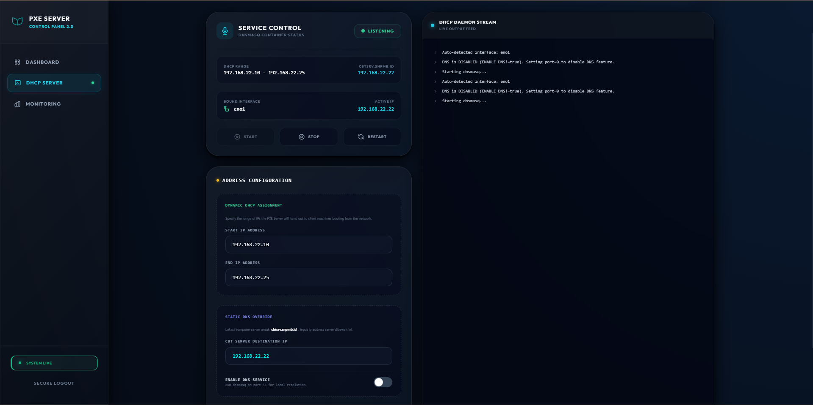
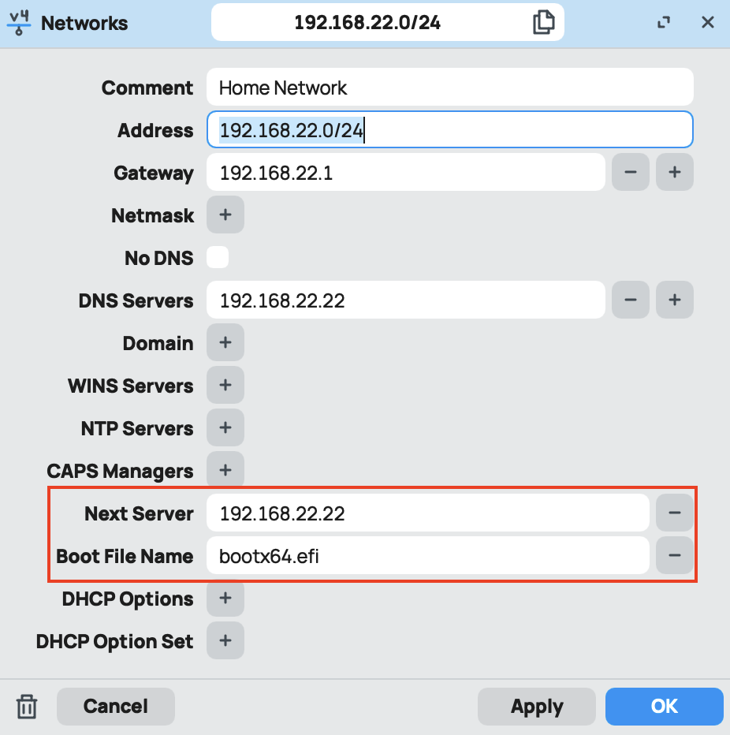

# 🚀 UTBK PXE Server 2.0

**UTBK PXE Server** adalah platform orkestrasi PXE Boot yang dirancang untuk pendistribusian sistem operasi secara cepat dan efisien melalui jaringan lokal maupun antar-network. Aplikasi ini mengotomatisasi proses ekstraksi ISO, konfigurasi iPXE, dan penyajian file sistem langsung dari RAM (tmpfs) untuk performa maksimal.



---

## 🛠️ Cara Instalasi

### 0. Instalasi Docker (Jika belum ada):
Jika server Anda baru, jalankan perintah satu baris ini untuk instalasi Docker otomatis:
```bash
curl -fsSL https://get.docker.com | sh && sudo usermod -aG docker $USER
```

### 1. Persyaratan:
- Perangkat dengan interface jaringan fisik (ens/eth)
- Akses Root/Sudo
- **Penting**: Pastikan port `80` pada host tidak sedang digunakan oleh aplikasi lain (seperti Apache/Nginx bawaan) agar server PXE dapat berjalan normal.

### 2. Jalankan Server:
   ```bash
   git clone https://github.com/arryardhiana/utbk-pxe-server.git
   cd utbk-pxe-server
   
   # Jalankan Orchestrator & Monitoring (Netdata)
   docker compose up -d --build
   ```

### 3. Jalankan DHCP Server (Opsional):
Jika Anda ingin UTBK PXE Server juga bertindak sebagai DHCP Server (untuk memberikan IP otomatis ke client), jalankan perintah ini:
   ```bash
   docker compose -f docker-compose.yml -f docker-compose.dhcp.yml up -d
   ```




4. **Akses Dashboard**:
   - **Main Dashboard**: `http://ip-server:8000`
   - **Netdata Monitoring**: `http://ip-server:19999`

---

## ✨ Fitur Utama

- **Built-in DHCP Server**: Sistem manajemen DHCP yang terintegrasi (via dnsmasq) dengan deteksi interface jaringan otomatis.
- **Smart DNS Control**: Fitur untuk mengaktifkan/menonaktifkan DNS resolver langsung dari dashboard web (Toggle ENABLE_DNS).
- **Built-in Monitoring**: Pantau statistik client (Min/Max) dan kecepatan network (Real-time & 6h history) langsung di dashboard utama tanpa database.
- **Optional Netdata**: Monitoring mendalam tingkat OS yang dapat diaktifkan melalui port `19999`.
- **High Performance**: Penyajian file sistem langsung dari RAM (tmpfs) untuk mempercepat proses loading client.


---

## 🛠️ Penggunaan DHCP & DNS



Jika Anda menjalankan **DHCP Server** (`docker-compose.dhcp.yml`), Anda dapat mengatur parameter berikut melalui tab **DHCP Server** di dashboard:
1. **DHCP Range**: Tentukan rentang IP Start dan IP End untuk client.
2. **CBT Server Destination**: Secara otomatis memetakan hostname `cbtsrv.snpmb.id` ke IP yang Anda tentukan (Sangat berguna untuk simulasi/lokal).
3. **Enable DNS Service**: Sakelar (Toggle) untuk mengaktifkan fitur DNS pada port 53. Jika dimatikan, service hanya menjalankan fungsi DHCP (Port 67) saja.

---

## 🛰️ Contoh Konfigurasi MikroTik (External DHCP)

Agar client dapat booting melalui server ini, Anda perlu mengatur DHCP Options pada router anda.

### Melalui Winbox/Terminal:
Masuk ke menu `/ip dhcp-server network` dan atur parameter berikut pada jaringan yang digunakan:

```bash
# Ganti <SERVER_IP> dengan IP Server UTBK PXE Anda
/ip dhcp-server network
set [find address=192.168.22.0/24] \
    next-server=<SERVER_IP> \
    boot-file-name=bootx64.efi
```


### Penjelasan Parameter:
- **Next Server (Option 66)**: Alamat IP Host tempat UTBK PXE Server berjalan.
- **Boot File Name (Option 67)**:
  - Gunakan `bootx64.efi` (Standard UEFI).

---

## 📄 Lisensi & Hak Cipta
Sistem ini dikembangkan oleh **Arry A - Universitas Padjadjaran**.  
Copyright © 2026. All rights reserved.

---
*Terima kasih telah menggunakan UTBK PXE Server.*
